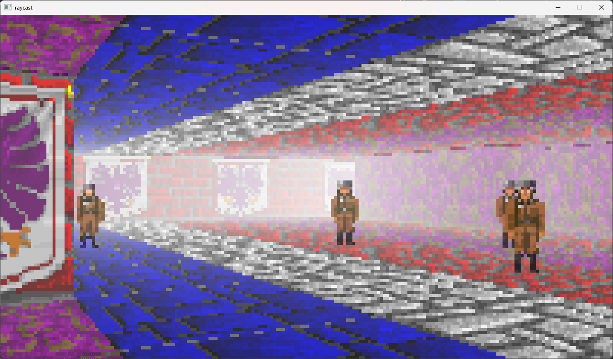

# Simple C++ Raycaster

This project is build using [Bazel](https://github.com/bazelbuild/bazel) and bzlmod build configs.
Also this project is build with msvc compiler.

# Dependencies

[SDL](https://github.com/libsdl-org/SDL)

My fork of [SDL2pp](https://github.com/libSDL2pp/libSDL2pp) - [SDL2wrapper](https://github.com/ertrod/SDL2wrapper)

# Current progress

- One level raycasting
- Textured rendering
- Ceil and floor casting with different maps
- Correct enemy rendering

